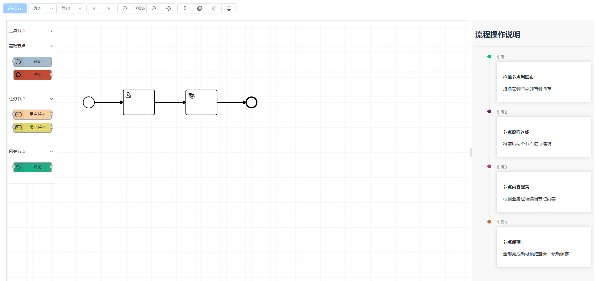
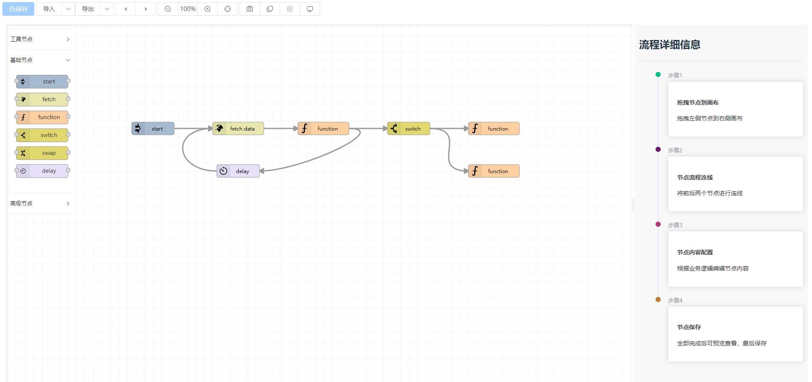

# PandaFlowUI

<h3 align="center">PandaFlowUI 工作流及规则引擎</h3>

<h3 align="center">基于LogicFlow完成的工作流及规则引擎 Vue3.0 + TypeScript + vite2 + Element-plus技术</h3>

## 🌈简介

* 前端采用VUE3.0+ TypeScript + vite2 + Element-plus
* 规则引擎流生成，仿照node-red完成的。
* 工作流引擎生成，完成审批等。

## 🏭在线体验

演示地址：http://47.104.252.2:8080/  帐号：admin 密码：123456

---
系统在线文档
---
* 文档地址 ：https://xm-go.gitee.io/pandax-docs

**> 未来会补充文档和视频，方便友友们使用！**

## 🚧系统截图

<table>
    <tr>
        <td></td>
        <td></td>
    </tr>

</table>
更多功能请访问系统体验

#### 💒 代码仓库

- PandaX 快速开发平台 <a href="https://github.com/XM-GO/PandaX" target="_blank">https://github.com/XM-GO/PandaX</a>
- PandaUI  平台Ui <a href="https://github.com/XM-GO/PandaUi" target="_blank">https://github.com/XM-GO/PandaUi</a>
- PandaFlowUi  平台Ui <a href="https://github.com/XM-GO/PandaFlowUi" target="_blank">https://github.com/XM-GO/PandaFlowUi</a>
- 
## 联系我们
**QQ：2417920382**  <a target="_blank" href="http://wpa.qq.com/msgrd?v=3&amp;uin=2417920382&amp;site=qq&amp;menu=yes">    点击这里给我发消息</a>

**QQ群：467890197**  

## ⚡ 内置功能

1.  _工作流。_
2.  _规则引擎。_

---
前端工程结构
---

## ❤特别鸣谢

* 感谢[LogicFlow](http://logic-flow.org/)

---
版权说明
---

* PandaX快速开发平台采用Apache-2.0技术协议
* 代码可用于个人项目等接私活或企业项目脚手架使用，PandaX全系开源版完全免费
* 二次开发如用于商业性质或开源竞品请先联系群主审核
* 允许进行商用，但是不允许二次开源出来并进行收费
* 请不要删除和修改PandaX源码头部的版权与作者声明及出处
* 不得进行简单修改包装声称是自己的项目
* 我们已经申请了相关的软件开发著作权和相关登记
* 如有使用我们项目功能等的扩展项目，请在项目介绍中，进行明确说明

#### 💌 支持作者

如果觉得框架不错，或者已经在使用了，希望你可以去 <a target="_blank" href="https://github.com/PandaGoAdmin/PandaX">PandaX</a> 或者
<a target="_blank" href="https://github.com/PandaGoAdmin/PandaUi">PandaUi</a> 帮我点个 ⭐ Star，这将是对我极大的鼓励与支持。
